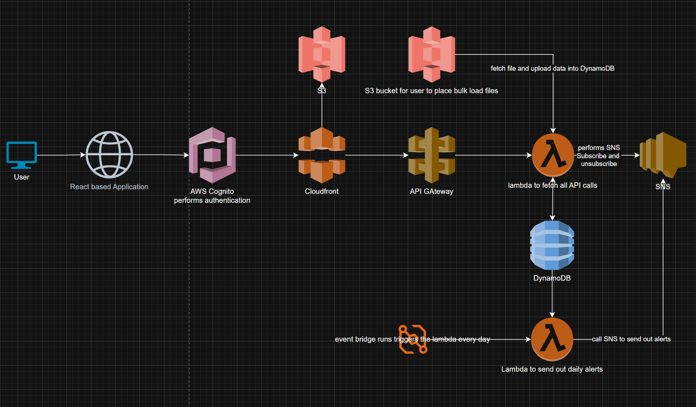
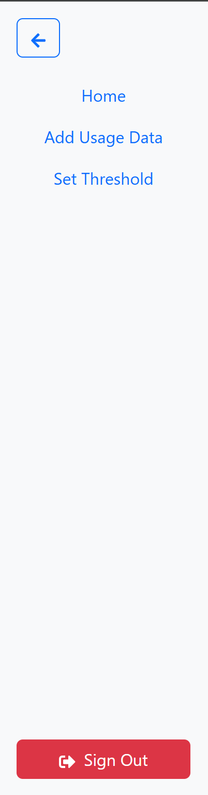
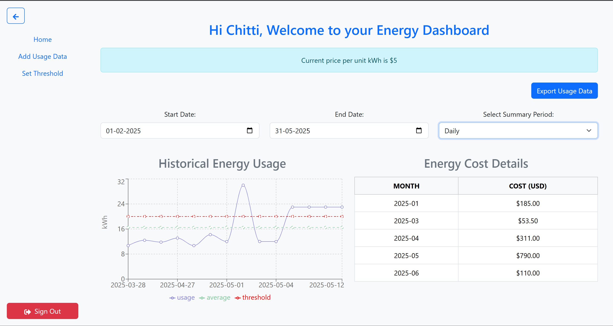
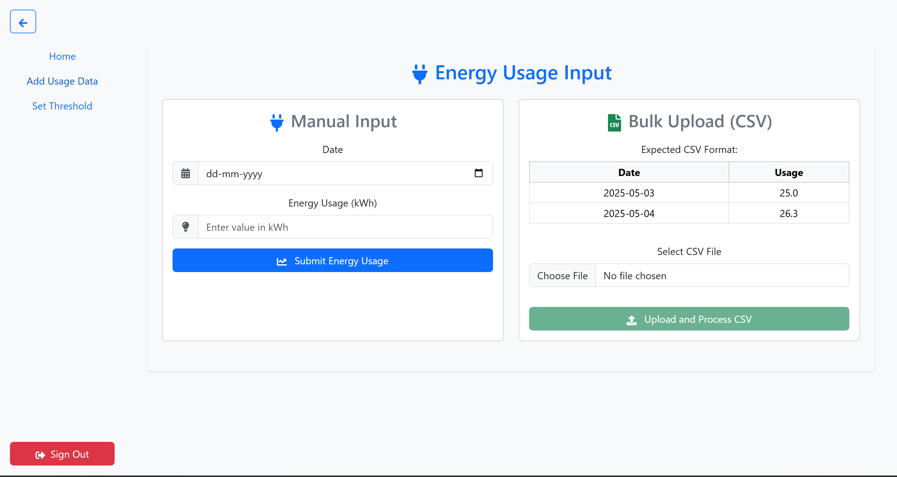
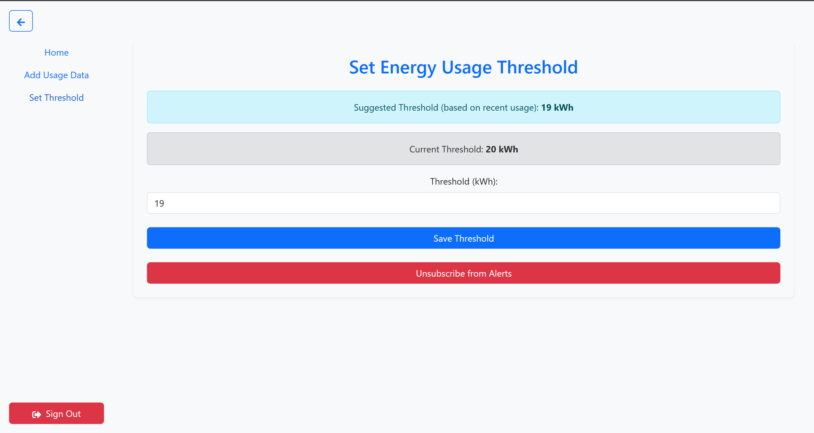

# Energy Management Dashboard

A React-based dashboard application that provides authenticated users with insights into their energy usage, costs, and threshold alerts. This project integrates AWS Amplify for user authentication and backend APIs.

**Live Demo:** [https://d3qmvg6f2zn4it.cloudfront.net](https://d3qmvg6f2zn4it.cloudfront.net)

---

## Table of Contents

- [Project Structure](#project-structure)
- [Component Overview](#component-overview)
- [Utilities](#utilities)
- [Getting Started](#getting-started)
  - [Prerequisites](#prerequisites)
  - [Installation](#installation)
  - [Environment Variables](#environment-variables)
- [AWS Amplify Setup](#aws-amplify-setup)
- [Running Locally](#running-locally)
- [Production Build](#production-build)
- [Deployment](#deployment)
- [Learn More](#learn-more)
- [License](#license)

---

## Project Structure

```text
customer-usage/
├── src/
│   ├── components/
│   │   ├── NavBar.js         # Top navigation bar with links and logout
│   │   └── ProtectedRoute.js # HOC to guard authenticated routes
│   ├── pages/
│   │   ├── HomeRedirect.js   # Main dashboard: usage charts, costs, thresholds
│   │   ├── InputForm.js      # Form to request custom energy data queries
│   │   └── SetThreshold.js   # UI to configure usage threshold alerts
│   ├── utils/
│   │   ├── authHelpers.js    # Helper functions to get tokens & user info
│   │   ├── apiRoutes.js      # REST API endpoint constants
│   │   └── constants.js      # App-wide constants (e.g. API base URL)
│   ├── App.js                # Root component with route definitions
│   ├── index.js              # React entry point
│   └── aws-exports.js        # AWS Amplify configuration (auto-generated)
├── architecture-diagram.png  # High-level system architecture
└── README.md                 # This documentation file
```



---

## UI Screenshots

Below are placeholders for you to add screenshots of the UI components. Update the image paths as needed.

### NavBar



### Dashboard



### Input Form



### Set Threshold



---

## Component Overview

### `NavBar.js`
Displays the top navigation bar across all pages. Includes:
- Links to dashboard, thresholds, input form
- Logout button for authenticated users

### `ProtectedRoute.js`
A higher-order component that wraps React Router routes. It:
- Checks authentication status via Amplify
- Redirects unauthenticated users to the login page

### `HomeRedirect.js`
The main energy dashboard for a logged-in user. Responsibilities:
- Fetch and display historical energy usage (daily/weekly/monthly/quarterly/yearly)
- Plot usage vs.
  average and threshold on a Recharts line chart
- Show aggregated cost data in a table
- Provide an "Export to CSV" feature
- Validate and update date range and period selections

### `InputForm.js`
A form allowing users to request custom energy data queries. It:
- Collects date range and period inputs
- Submits to backend REST API
- Displays results in chart or table formats
- Allows uploading CSV files for bulk energy usage import (with preview, S3 upload, and Lambda processing)

### `SetThreshold.js`
Enables users to set or update energy usage thresholds. It:
- Collects threshold values via form fields
- Posts new thresholds to backend
- Shows current threshold history
- Gives an option for user to subscribe and unsubscribe from alerts

---

## Utilities

### `authHelpers.js`
Provides functions to:
- Retrieve current AWS Cognito ID token
- Extract user email (used as `customer_id`)

### `apiRoutes.js`
Exports constants for REST API paths:
- `ENERGY_HISTORY`
- `ENERGY_SUMMARY`
- `ENERGY_COSTS`
- `CURRENT_THRESHOLD`

---

## APIs

Below is a summary of the REST endpoints exposed by the backend. All requests require an `Authorization: Bearer <idToken>` header:

### GET /energy/history
Fetch historical energy usage.
Request query parameters:
- `startDate` (YYYY-MM-DD)
- `endDate` (YYYY-MM-DD)
- `customer_id` (user email)
Example:
```bash
curl -H "Authorization: Bearer $ID_TOKEN" "${API_INVOKE_URL}/energy/history?startDate=2023-01-01&endDate=2023-01-31&customer_id=user@example.com"
```
Response:
```json
[
  { "date": "2023-01-01", "usage": 8.5 },
  { "date": "2023-01-02", "usage": 9.2 }
]
```

### GET /energy/current-threshold
Get the current alert threshold for the user.
Query:
- `customer_id`
Example:
```bash
curl -H "Authorization: Bearer $ID_TOKEN" "${API_INVOKE_URL}/energy/current-threshold?customer_id=user@example.com"
```
Response:
```json
{ "threshold": 12 }
```

### POST /energy/alerts
Set a new threshold alert.
JSON body:
```json
{ "customerId": "user@example.com", "threshold": 15 }
```
Response: HTTP 200 OK

### GET /energy/costs
Get aggregated cost data.
Query parameters: same as `/energy/history`.
Response: array of `{ month, cost }` objects.

### GET /energy/get-presigned-url
Generate a presigned URL for uploading CSV files.
Query parameters:
- `customerId` (user email)
- `fileName` (CSV file name)
Example:
```bash
curl -H "Authorization: Bearer $ID_TOKEN" "${API_INVOKE_URL}/energy/get-presigned-url?customerId=user@example.com&fileName=data.csv"
```
Response:
```json
{ "presignedUrl": "...", "fileUrl": "https://bucket/uploads/data.csv" }
```

### POST /energy/process-file
Process an uploaded CSV file and store its data in DynamoDB.
JSON body:
```json
{ "customerId": "user@example.com", "fileUrl": "https://bucket/uploads/data.csv" }
```
Response:
```json
{ "message": "File processed and data stored successfully!" }
```

### Other endpoints:
- `GET /energy/summary` (periodic summary)
- `GET /energy/costs`
- `POST /energy/input` (custom query)
- `POST /energy/setup-sns` and `POST /energy/unsubscribe-sns` for SNS alerts

---

## Getting Started

### Prerequisites

- Node.js (v14.x or later)
- npm or yarn
- AWS account with appropriate IAM permissions
- AWS Amplify CLI: `npm install -g @aws-amplify/cli`

### Installation

1. Clone this repository:
   ```bash
   git clone https://github.com/your-repo/energy-management-dashboard.git
   cd energy-management-dashboard
   ```
2. Install project dependencies:
   ```bash
   npm install
   # or
   yarn install
   ```

#### Environment Variables

Create a `.env.local` file in the project root with:
```
REACT_APP_API_INVOKE_URL=https://your-api-gateway-url
``` 
AWS Amplify configuration is managed by `aws-exports.js` after running the Amplify setup.

---

## AWS Amplify Setup

1. **Initialize Amplify**:
   ```bash
   amplify init
   ```
   - Choose your default editor
   - Select AWS profile
   - Set environment name (e.g. `dev`)
   - Accept defaults for other prompts

2. **Add Authentication**:
   ```bash
   amplify add auth
   ```
   - Default configuration (Cognito User Pool)

3. **Add REST API** (if not already configured):
   ```bash
   amplify add api
   ```
   - Select REST
   - Provide path (e.g. `/energy`)
   - Attach to an existing or new Lambda function

4. **Push Backend**:
   ```bash
   amplify push
   ```
   - Deploys auth, API, and Lambda resources

5. **Add Hosting** (Optional - for front-end hosting):
   ```bash
   amplify add hosting
   ```
   - Choose environment (e.g. `DEV`) and service (S3 & CloudFront)

6. **Publish App**:
   ```bash
   amplify publish
   ```
   - Builds the app, uploads to hosting, and provides a URL

---

## Running Locally

Start the development server:
```bash
npm start
# or
yarn start
```
Open your browser at [http://localhost:3000](http://localhost:3000).

---

## Production Build

Generate an optimized build:
```bash
npm run build
# or
yarn build
```
The static files will be in the `build/` directory.

---

## Deployment

### 1. AWS Amplify Hosting

After `amplify publish`, your app will be served via the Amplify-provided URL. To use a custom domain:
1. In the Amplify Console, navigate to your app
2. Select **Domain Management**
3. Add your custom domain and update DNS records as instructed

### Alternative Hosting
You can also deploy the build directory to any static hosting provider (e.g., Netlify, Vercel, GitHub Pages).

### 2. Terraform Deployment

This project includes Terraform scripts in the `terraform/` directory to provision backend infrastructure.

1. Ensure [Terraform](https://www.terraform.io/downloads.html) v1.x or later is installed.
2. Configure your AWS credentials (e.g. `aws configure` or environment variables).
3. Navigate to the Terraform directory:
   ```bash
   cd terraform
   ```
4. (Optional) Review or customize variables in `variables.tf` or create a `terraform.tfvars` file.
5. Initialize Terraform:
   ```bash
   terraform init
   ```
6. Generate and review the execution plan:
   ```bash
   terraform plan
   ```
7. Apply the plan to create resources:
   ```bash
   terraform apply
   ```
8. Once done, note any outputs (API Gateway URL, S3 bucket, etc.):
   ```bash
   terraform output
   ```
9. To destroy the resources:
   ```bash
   terraform destroy
   ```

### 3. Testing the App
- **Local Test**: Run `npm start` and open `http://localhost:3000`.
- **API Test**: Use `curl` or Postman with the endpoints above.
- **CI/CD**: Integrate `npm run build` and `amplify publish` into your pipeline.

